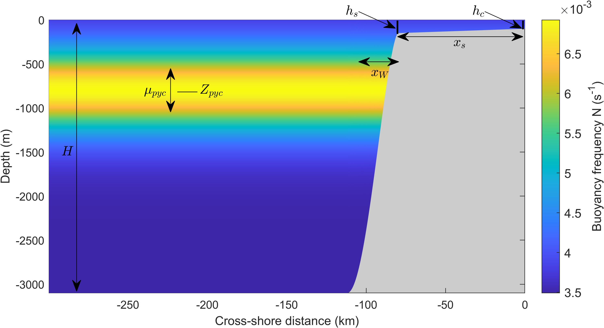

# coastal_internal_tides
 Data and code repository to accompany manuscript titled "Internal tides at the coast: energy flux of baroclinic tides propagating into the deep ocean in the presence of supercritical shelf topography"

### Model set-up

 

 Topography:
$$h = -H, \qquad  x<-x_s; $$
$$h = -h_s -(H-h_s) \left[0.5\left(1-\mbox{cos}\left(\frac{\pi(x+x_s)}{x_w}\right)\right)\right]^{0.75}, \qquad -(x_s+x_w)< x <-x_s; $$
$$h = \frac{h_s-h_c}{x_s} x - h_c, \qquad x>-x_s    $$

where, as shown in the diagram, $H$ is the maximum depth at the flat off-shore potion of the domain, $h_c$ is the shelf depth at the shore, $h_s$ is the shelf depth at the shelf break, $x_{s}$ is the shelf width, and $x_{w}$ is the slope width.

Stratification:
$$N^2 = N_{bg}^2 + \frac{\rho_2-\rho_1}{\rho_0}\frac{g}{\mu_{pyc}}\left[\mbox{sech}\left(\frac{z-Z_{pyc}}{\mu_{pyc}} \right) \right]^2 $$

where $\rho_1$ and $\rho_2$ are the densities of upper and lower layers, respectively, background density is $\rho_0 = 0.5(\rho_1+\rho_2)$, $\mu_{pyc}$ is pycnocline thickness, $Z_{pyc}$ is pycnocline depth, and $N_{bg}^2$ is the constant buoyancy frequency squared associated with background linear density gradient.

### "data" folder 
 Data generated in the manuscript (see additional details for each file in ./data/README.txt)
 
### "matlab_functions" folder
 - Underlying matlab functions to solve coupled velocity-pressure equations (see each file for details);\
 - func_simulation.mat: solves simulation with relevant physical outputs for a set of input parameters (stratification, topography, forcing)\
 - func_resonance.mat: solves simulation, but only outputs domain-integrated pressure and velocity response to be used for resonance sweeps
 
### "python_post_processing" folder 
 Examples of how to plot output data (from "data" folder) in Python; here, using Jupyter notebook
 
### run_simulation.mat
 - File to run an example simulation with specified grid spacing, topography, and stratification parameters 
 - Also can specify Coriolis parameter, forcing frequency, along-shore wavenumber, forcing type (Baines vs. isolated), surface boundary condition (rigid lid vs. free linear surface)
 - Outputs velocity and pressure fields plus energy flux fields (cross-shore, along-shore; 2D and vertically integrated values)
 - Plots relevant fields (topography, stratification, topographic criticality, 2D forcing, cross-shore energy flux) 

### run_resonance_scan.mat
 - File to run a resonance scan over a range of frequency and along-shore  wavenumbers with specified grid spacing, topography, and stratification parameters 
 - Also can specify Coriolis parameter, forcing type (Baines vs. isolated),  surface boundary condition (rigid lid vs. free linear surface)
 - Outputs domain-integrated values of pressure and cross-shore velocity for each value of frequency and along-shore wavenumber. Modes are resonant if these values are amplified.
 - Plots resonance scan (domain-integrated pressure values) sweeping over frequency and along-shore wavenumbers and dispersion curves for other relevant modes.

### run_resolution_test.mat
 - File to run a resolution test (for vertical and horizontal resolutions) for an example simulation with specified grid spacing, topography, and stratification parameters 
 - Also can specify Coriolis parameter, forcing frequency, along-shore wavenumber, forcing type (Baines vs. isolated), surface boundary condition (rigid lid vs. free linear surface)
 - Outputs and plots vertically-integrated cross-shore energy flux for different vertical and horizontal resolutions to assess convergence.

### run_domain_size_test.mat
 - File to run a domain size test for an example simulation with specified grid spacing, topography, and stratification parameters 
 - Also can specify Coriolis parameter, forcing frequency, along-shore wavenumber, forcing type (Baines vs. isolated), surface boundary condition (rigid lid vs. free linear surface)
 - Outputs and plots vertically-integrated cross-shore energy flux for different domain sizes to assess convergence.
